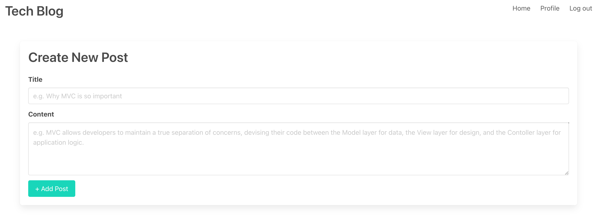
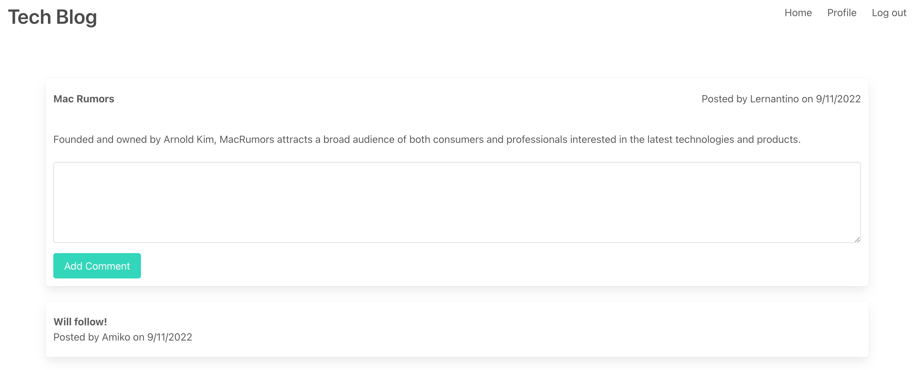

# Tech_Blog-MVC

  ## Description

  This application is CMS-style blog site similar to a Wordpress site, where developers can publish their blog posts and comment on other developers’ posts as well. This app follows the MVC paradigm in its architectural structure, using Handlebars.js as the templating language, Sequelize as the ORM, and the express-session npm package for authentication.

  ## Live Page
  [LIVE LINK](https://whispering-headland-43822.herokuapp.com/login)

  ## Screenshots:
  
  

  ## Table of Contents
  #### [Usage](#usage)
  #### [Contribution](#contribution)
  #### [License](#license)
  #### [Contact](#questions)

  ## Usage
  - Log-in/Sign-up
  - Home Page:
    - View all posts from all users
    - Click a post to comment
    - Scroll to bottom of page to add a new post
  - Profile Page:
    - View all your posts
    - Click a post to edit
    - You can delete a post
    - Scroll to bottom of page to add a new post   
    
  ## Contribution

  - Submit a pull request

  ## License

  

  
  
